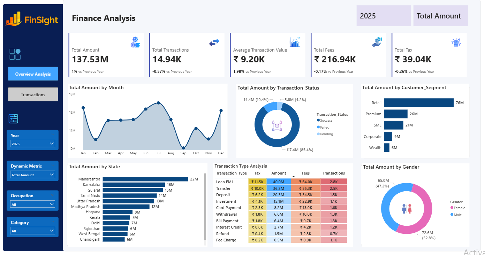
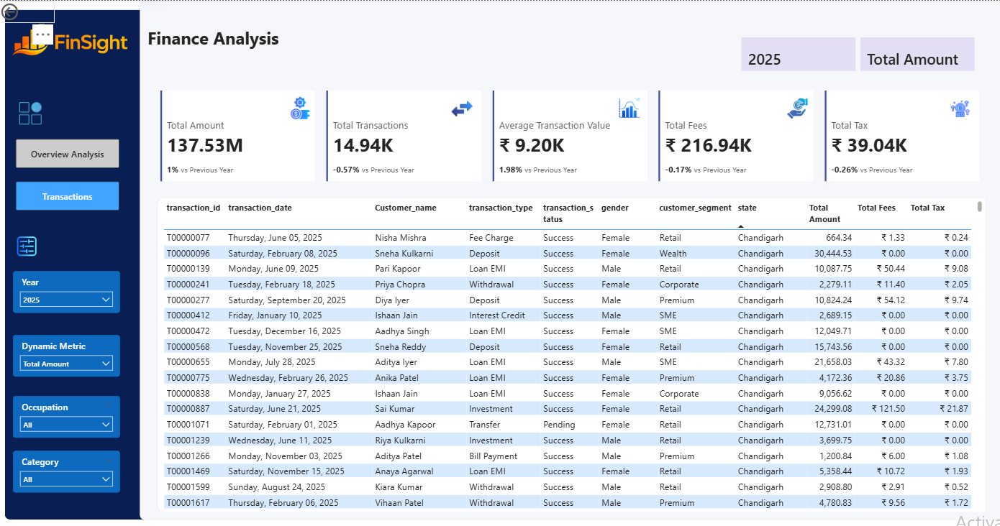

# Task 3: Finance Analytics Dashboard

## 📌 Project Overview

This project was completed as **Task 3 (Dashboard Design)** for the **Ministry of Micro, Small and Medium Enterprises (MSME), Government of India – Data Analyst Internship**.

The objective was to design an interactive **Finance Analytics Dashboard** that enables business stakeholders to monitor financial performance, customer behavior, transaction trends, and operational metrics through dynamic and interactive visualizations.

The dashboard transforms raw financial transaction data into meaningful business insights that support data-driven decision-making.

---

# 🎯 Business Objective

A financial organization required an interactive dashboard to monitor:

- Overall financial performance
- Transaction growth
- Customer behavior
- Monthly transaction trends
- Customer segment contribution
- State-wise performance
- Transaction success rate
- Fees and tax collection
- Year-over-Year (YoY) performance

The dashboard allows users to dynamically filter the analysis by:

- Year
- Dynamic KPI
- Occupation
- Category

---

# 🛠️ Tools Used

- Microsoft Power BI
- Power Query
- DAX
- Data Modeling
- Microsoft Excel

---

# 📂 Dataset

Finance Analytics Dataset

Contains customer information and financial transaction records including:

- Customer Details
- Transaction Amount
- Fees
- Tax
- Transaction Type
- Transaction Status
- Customer Segment
- State
- Occupation
- Transaction Date

---

# 🧹 Data Preparation

The following preprocessing steps were performed before building the dashboard:

- Removed extra spaces from the **Channel** column.
- Removed duplicate records based on **Transaction ID**.
- Converted **Date of Birth** and **Join Date** columns from text to date format.
- Corrected negative values in the **Amount** column.
- Replaced missing values in the **Fee Amount** column using the average value.
- Standardized the **Currency** column by converting all values to uppercase.
- Merged **First Name** and **Second Name** into a single **Customer Name** column.
- Performed data modeling by joining the **Customer** and **Finance Transactions** tables.

---

# 📅 Date Table

A dedicated Date Table was created using DAX to support time intelligence analysis.

The table includes:

- Date
- Year
- Month
- Minimum Date
- Maximum Date

The Date Table was connected to the Finance Transactions table using the Transaction Date column to enable Year-over-Year (YoY) calculations.

---

# 📈 Dashboard Features

## KPI Cards

- Total Amount
- Total Transactions
- Average Transaction Value
- Total Fees
- Total Tax
- Year-over-Year Growth

---

## Interactive Filters

- Year
- Dynamic Metric
- Occupation
- Category

---

## Visualizations

- Monthly Transaction Trend
- Transaction Status Analysis
- Customer Segment Analysis
- State-wise Performance
- Transaction Type Analysis
- Gender Analysis
- Transaction Detail Grid

---

# 📊 Key Performance Indicators

| KPI | Value |
|------|--------|
| Total Amount | ₹137.53M |
| Total Transactions | 14.94K |
| Average Transaction Value | ₹9.20K |
| Total Fees | ₹216.94K |
| Total Tax | ₹39.04K |

---

# 💡 Key Business Insights

- Total transaction amount reached **₹137.53M**.
- More than **14.94K** financial transactions were processed.
- Retail customers contributed the highest transaction amount.
- Loan EMI generated the highest transaction value among all transaction types.
- Maharashtra recorded the highest financial transaction amount.
- Successful transactions represented the majority of processed transactions.
- Interactive filtering enables detailed business analysis across multiple dimensions.

---

# 💼 Business Recommendations

- Focus marketing efforts on high-value customer segments.
- Improve failed and pending transaction processing.
- Monitor monthly trends to identify seasonal patterns.
- Optimize high-performing transaction categories.
- Continue monitoring KPIs to support strategic decision-making.

---

# 🖥️ Dashboard Preview

## Overview Analysis

> *(Insert your Overview Dashboard Screenshot here)*



---

## Transaction Analysis

> *(Insert your Transaction Dashboard Screenshot here)*



---

# 📁 Repository Structure

```
Finance-Analytics-Dashboard-MSME-Task3
│
├── Finance Analytics Dashboard.pbix
├── customer.csv
├── finance_transactions.csv
├── Overview_Analysis.png
├── Transaction_Page.png
├── Dashboard_Summary.pptx
└── README.md
```

---

# 🚀 Skills Demonstrated

- Data Cleaning
- Data Transformation
- Data Modeling
- Power Query
- DAX Calculations
- KPI Development
- Interactive Dashboard Design
- Financial Analytics
- Time Intelligence (YoY Analysis)
- Business Intelligence
- Data Visualization
- Business Storytelling

---

# 📖 Project Outcome

This project demonstrates the ability to transform raw financial transaction data into an interactive executive dashboard that supports business monitoring, operational analysis, and strategic decision-making.

The dashboard provides real-time insights into financial performance, customer behavior, transaction efficiency, and regional performance while enabling users to explore data dynamically through interactive filters.

---

## 👩‍💻 Author

**Lidiya Duguma**

Data Analyst | Power BI | SQL | Python | Excel

GitHub: https://github.com/Lidiya2324

LinkedIn: https://www.linkedin.com/in/lidiya-mitiku-10b816189/
